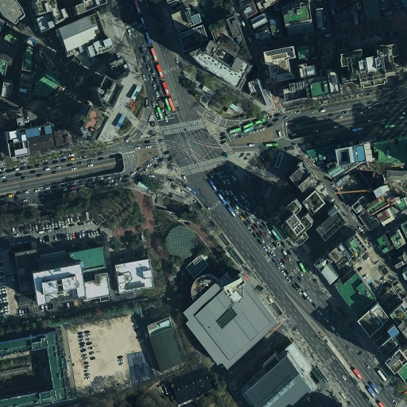
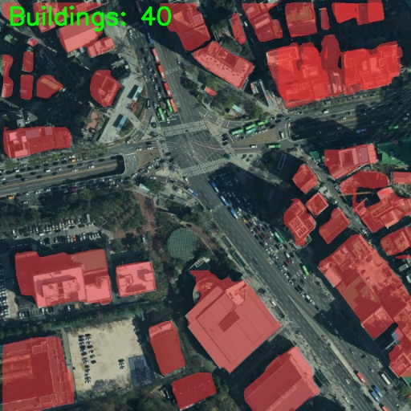

# YOLOv5 Buildings Segmentation Prediction

This repository contains a script for making segmentation predictions using YOLOv5. It is designed to work with images, allowing you to visualize and save the results.

## Usage

1. **Clone the Repository:**
    ```bash
    git clone https://github.com/topazlas/Building_Segmentation.git
    cd Building_Segmentation
    ```

2. **Create a Virtual Environment:**
    ```bash
    conda env create -f environment.yaml
    conda activate BS
    ```

3. **Organize Input Data:**
    - For image predictions: Place your images in the `dataset/test/images` directory.

5. **Run the Prediction Script:**
    ```bash
    python predict.py --weights runs/custom/weights/best.pt --source data/images --device 0
    ```
    - Customize other options as needed. See the [Options](#options) section for details.

6. **View Results:**
    - The script will save the results in the `runs/predict-seg/exp` directory by default.

## Options
- `--weights`: Path to the YOLOv5 segmentation model weights file.
- `--source`: Path to the input image or video file or a directory containing images.
- `--data`: (Optional) Path to the dataset.yaml file. Default is `data/coco128.yaml`.
- `--imgsz`: (Optional) Inference size (height, width). Default is `640`.
- `--conf-thres`: (Optional) Confidence threshold for detections. Default is `0.25`.
- `--iou-thres`: (Optional) NMS IoU threshold. Default is `0.45`.
- `--max-det`: (Optional) Maximum detections per image. Default is `1000`.
- `--device`: (Optional) CUDA device(s) for inference, e.g., `0` or `0,1,2,3` or `cpu`. Default is an empty string.
- `--view-img`: (Optional) Show results. Default is `False`.
- `--save-txt`: (Optional) Save results to `*.txt`. Default is `False`.
- `--save-conf`: (Optional) Save confidences in `--save-txt` labels. Default is `False`.
- `--save-crop`: (Optional) Save cropped prediction boxes. Default is `False`.
- `--nosave`: (Optional) Do not save images/videos. Default is `False`.
- `--classes`: (Optional) Filter by class, e.g., `--classes 0` or `--classes 0 2 3`.
- `--agnostic-nms`: (Optional) Class-agnostic NMS. Default is `False`.
- `--augment`: (Optional) Augmented inference. Default is `False`.
- `--visualize`: (Optional) Visualize features. Default is `False`.
- `--update`: (Optional) Update all models. Default is `False`.
- `--project`: (Optional) Save results to project/name. Default is `runs/predict-seg`.
- `--name`: (Optional) Save results to project/name. Default is `exp`.
- `--exist-ok`: (Optional) Existing project/name ok, do not increment. Default is `False`.
- `--line-thickness`: (Optional) Bounding box thickness (pixels). Default is `3`.
- `--hide-labels`: (Optional) Hide labels. Default is `False`.
- `--hide-conf`: (Optional) Hide confidences. Default is `False`.
- `--half`: (Optional) Use FP16 half-precision inference. Default is `False`.
- `--dnn`: (Optional) Use OpenCV DNN for ONNX inference. Default is `False`.

## Example

```bash
python segment/predict_noBbox_detectNum.py --weights runs/custom/weights/best.pt --source data/images --device 0
```

### Original Image
</img><br/>

### Inferred Image
</img><br/>

## License
All code and documentation in this project are available under the [MIT License](https://opensource.org/licenses/MIT).
See the [LICENSE file](./LICENSE) for details.


